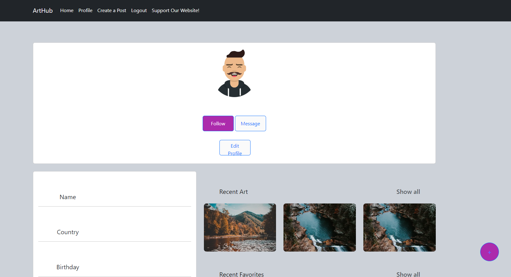

# ArtHub

Live website [here!](https://github.com/PhenolLully/group-project-3)

Description of your project.

## Installation

If you would like to clone the repository and see how everything works just follow the steps below!

1. Clone the repository.
2. Install dependencies using `npm install`.
3. Start the Webpage and server using `npm run start`.

Note: Make sure to rename your .env file to fit your mongodb fields

## Usage

...

## Contributors

- [Phenol J Lully](https://github.com/PhenolLully)
- [Troy Mena](https://github.com/TroyMena)
- [Todd Fowler](https://github.com/tyfowler1)
- [Brandon Webb](https://github.com/Bmwebb215)
- [Danny Saravia](https://github.com/Dannysaravia001)

## Website Screenshot

The screenshot below shows a portfolio from the website at the time of writing this README file:

## Sources

- Bootcamp tutor, Jose Lopez

## Live Application URL

https://arthub-uaok.onrender.com/